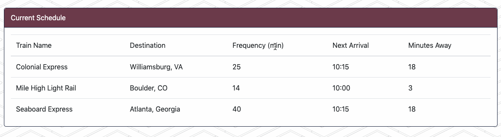

# Train-time

An app that stores inputted information about any train schedule the user wants to add into a Firebase database.

## Technologies

- HTML
- CSS
- Javascript
- jQuery
- Moment.js
- Firebase

## Demo

To input a new train, the user must fill in all the required forms. Once done, this will add the new train to the master list above the forms.

The data is stored in and retrieved from the Firebase database.

The site also update the next train's arrival time and how many minutes away that time is every time the page is reloaded.

